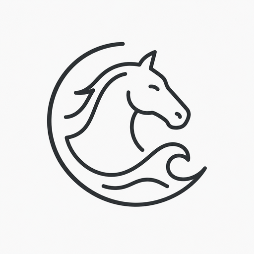
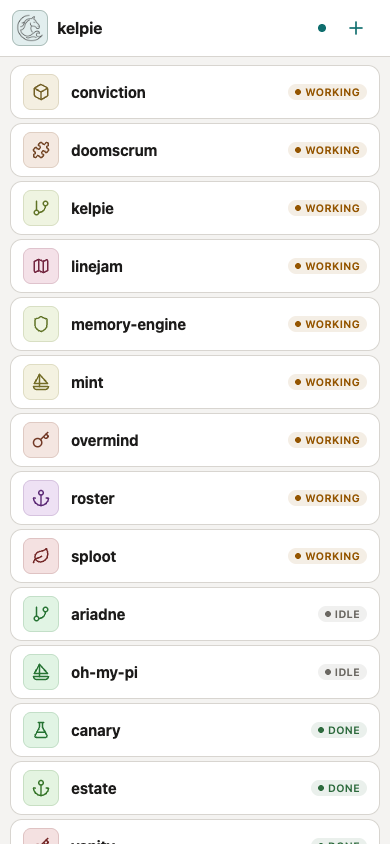
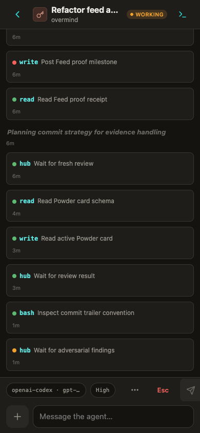
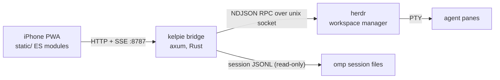

<p align="center">
  
</p>

<h1 align="center">kelpie</h1>

<p align="center">
  A phone-first console for triaging a fleet of
  <a href="https://github.com/can1357/oh-my-pi">omp</a> coding agents running in
  <a href="https://herdr.dev">herdr</a> terminal workspaces.<br>
  One hand, one thumb, whole fleet.<br>
  <a href="https://misty-step.github.io/kelpie/">misty-step.github.io/kelpie</a>
</p>

<p align="center">
  
  
</p>

## What it is

You run a herd of coding agents in terminal panes on your desk. You leave the
desk. kelpie is the pocket view: a tiny Rust bridge on the workstation plus a
zero-build web app you install to your phone's home screen.

- **Inbox** — every workspace, sorted by what needs you: pending asks first,
  then working, then idle/done, recency within each tier.
- **Agent session** — the omp transcript as chat (markdown, tool cards,
  thinking blocks), a composer with slash commands and photo attachments,
  pending-ask option buttons, model + reasoning-effort pickers.
- **Terminal** — the raw pane screen with a key row (Enter, Esc, Ctrl+C,
  arrows, Tab) for anything the chat surface can't express.

Workspaces churn constantly, so nothing is configured per workspace: identity
(icon + hue) is derived deterministically by hashing the workspace name into a
fixed vocabulary. Zero workspaces, one, or fifty all render sensibly.

## How it works



- Fleet state comes from herdr's `session.snapshot`, polled every 1.2s and
  diffed; changes fan out to clients over SSE.
- Transcripts come straight from omp's session JSONL files (each herdr pane
  record carries the path). No ANSI parsing.
- Input goes back through herdr `pane.send_text` / `pane.send_keys`.
- The frontend is vanilla ES modules — no build step, no dependencies. The
  bridge serves everything with `Cache-Control: no-cache`, so deploys are
  just "restart the binary".

## Requirements

- macOS/Linux workstation running [herdr](https://herdr.dev)
  (`~/.config/herdr/herdr.sock`) with [omp](https://github.com/can1357/oh-my-pi)
  agents in its panes
- Rust toolchain (1.75+)
- [Tailscale](https://tailscale.com) (or any private network) to reach your
  workstation from the phone

## Quick start

```sh
git clone https://github.com/misty-step/kelpie
cd kelpie
cargo run --release
# kelpie listening on http://127.0.0.1:8787 (static: static)
```

The bridge binds loopback only — it has full control of your terminal panes,
so never expose it directly. Publish it to your tailnet with:

```sh
tailscale serve --bg 8787
```

Then on the iPhone, open the tailnet URL in Safari and **Share → Add to Home
Screen**. You get a standalone app with the kelpie icon, dark/light theme
following the system, and the on-screen keyboard handled correctly (visual
viewport tracking, not scroll hacks).

### Configuration

| Env | Default | Meaning |
|---|---|---|
| `KELPIE_STATIC` | `static` | Directory of frontend assets, relative to the working directory |

The bind address (`127.0.0.1:8787`) and herdr poll interval (1200ms) are
constants at the top of `src/main.rs`.

## API

Everything the frontend uses, usable from scripts too:

| Route | Purpose |
|---|---|
| `GET /api/fleet` | Workspaces, tabs, panes with status + pending-ask flags |
| `GET /api/session/{pane_id}` | Parsed omp transcript for a pane |
| `GET /api/pane/{pane_id}/screen` | Plain-text visible screen of any pane |
| `GET /api/commands` | omp slash-command catalog |
| `GET /api/models` | Model catalog (`omp models --json`, cached) |
| `GET /api/events` | SSE: `fleet` and `session` change pokes |
| `POST /api/pane/{pane_id}/text` | Send a line of text (Enter appended) |
| `POST /api/pane/{pane_id}/keys` | Send named keys (`Enter`, `Escape`, `ctrl+c`, …) |
| `POST /api/pane/{pane_id}/ask` | Answer a pending single-select ask by index |
| `POST /api/pane/{pane_id}/thinking` | Step the reasoning-effort cycle N times (serialized per pane) |
| `POST /api/pane/{pane_id}/upload` | Upload an image; returns a path omp can read |
| `POST /api/workspace`, `/api/tab`, … | Create/close workspaces and tabs |

### Why reasoning effort "cycles"

omp's interactive TUI has no runtime *set thinking level* command — no slash
command, and its RPC/ACP setters only exist for sessions launched in those
modes. The only lever on a live pane is the `app.thinking.cycle` keybinding
(Shift+Tab). kelpie's picker is exact anyway: it computes the number of steps
from the model's advertised level order, sends paced raw back-tab (`CSI Z`)
sequences (herdr's named `shift+tab` chord is accepted but ignored by omp),
serializes transitions per pane, and confirms against the live terminal footer
before claiming success. You will see the TUI walk through intermediate levels
— that is the mechanism, not a bug. If omp grows a runtime setter for
interactive sessions, `post_thinking` in `src/main.rs` is the one place to
swap.

## Code map

```
src/
  main.rs        axum bridge: fleet poller, routes, SSE
  herdr.rs       herdr unix-socket NDJSON RPC client
  omp.rs         omp session JSONL -> transcript / summary parsing
static/
  index.html     shell (PWA meta, icons)
  style.css      full design system (tokens in :root, dark via media query)
  app.js         entry point: router + boot
  js/            dom, icons, markdown, api, state, overlay, sse,
                 viewport, tabstrip, views/{inbox,session,term}
```

`DESIGN.md` documents the visual system — tokens, type scale, status colors,
motion rules, and the accessibility contract (WCAG AA in both themes, 44px
touch targets, `prefers-reduced-motion`).

## License

[MIT](LICENSE) © Misty Step
